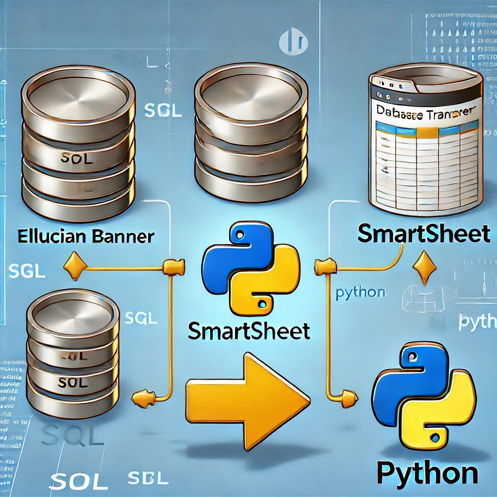

# Banner-to-Smartsheet-Data-Migration


# Banner to Smartsheet Data Migration  
**Migrating Data from Banner to Smartsheet using SQL and Python**  

## Disclaimer  
This content is designed for **beginner-level** team members, so concepts and terminology are explained in a simplified manner.  

---

## **Purpose & Overview**  
This repository provides a **baseline of fundamental tools and methods** for **extracting, transforming, and loading (ETL) data** between different systems. The goal is to introduce **repeatable, adaptable workflows** that can be **repurposed** for various data migration scenarios, including:  

- Moving structured data from **Banner (or other databases) to Smartsheet**  
- Automating **data extraction, transformation, and validation** using SQL and Python  
- Scheduling **automated updates** to keep destination systems in sync with source data  

By learning these foundational concepts and workflows, you will be able to **extend these techniques** to support **a wide range of ETL use cases** beyond this specific migration process.  

---

## **Table of Contents**  
- [Prerequisites](#prerequisites)  
- [Step 1: Overview](#step-1-overview)  
- [Step 2: Walkthrough](#step-2-walkthrough)  
- [Step 3: Tips & Tricks](#step-3-tips--tricks)  
- [Additional Resources](#additional-resources)  
- [IDE Recommendations](#ide-recommendations)  

---

## **Prerequisites**  
Before proceeding, ensure you meet the following requirements:  

- You have access to a [SQL Server database](https://ts.vcu.edu/about-us/computer-center/database-administration/sql-server/) with **Admin rights** or know the Admin who can make updates.  
- A database is set up to store ODS data (a new one can be created if you have Admin privileges).  
- You have **ownership or admin rights** to the target database.  
- **Microsoft SQL Server Management Studio (SSMS)** is installed on your local machine, and you have VPN access.  
- You have a development environment (IDE) set up for **Python 3.9** and Jupyter Notebooks (`pip install -r requirements.txt`).  
- You have an active **Smartsheet license**.  
- **Security & Compliance:** You have **explicit approval** from **InfoSec and the Banner team** to use your Banner data in Smartsheet.  
- **Best Practice:** In production environments, use a **service account** for production ownership roles.  

---

## **Step 1: Overview**  
This step covers the fundamental setup and concepts required before migrating data.  

### **1.1 Review IDE Setup**  
- **Virtual environments (`venv`)**  
- **Notebook operations**  
- **`requirements.txt` usage**  
- **Folder and file structure**  

### **1.2 Review SQL Management Studio (SSMS)**  
- **Tables and views**  
- **SQL operations**  

### **1.3 Smartsheet Setup**  
- **API Key**  
- **Sheet ID**  
- **Field requirements**  

---

## **Step 2: Walkthrough**  
A step-by-step guide to migrating data.  

### **2.1 Install Dependencies**  
- Install the required libraries:  
  ```bash
  pip install -r requirements.txt

